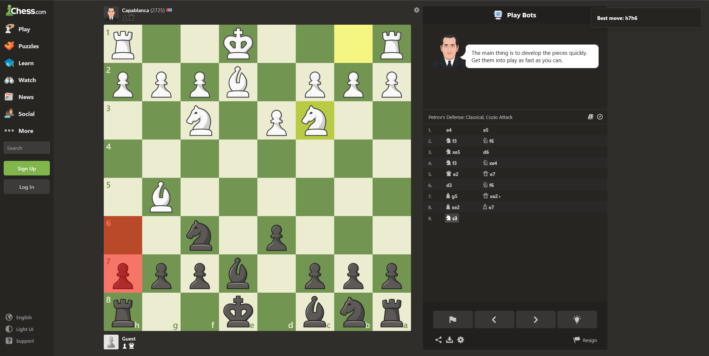

  

  
  
  

<h2>
<b>Chess Move Analyzer: Real-time Stockfish Analysis for Your Games</b>
</h2>

# ♟️ What is Chess Move Analyzer?

**Chess Move Analyzer** is a browser extension that enhances your Chess.com experience by providing real-time Stockfish analysis of your games. Get instant feedback on the best moves available, analyze your position, and improve your chess strategy with professional-grade insights.

  

# ⭐ Key Features

- **Real-time Analysis**: Get instant Stockfish evaluation of the current board position
- **Best Move Suggestions**: See the top 3 recommended moves with evaluation scores
- **Position Evaluation**: Numerical evaluation of your current position
- **Line Analysis**: View potential continuation lines for each suggested move
- **Non-intrusive Design**: Seamlessly integrates with Chess.com's interface
- **Custom Engine Depth**: Adjust analysis depth based on your needs
- **Legal Move Validation**: Ensures all suggested moves are legal in the current position

# 📋 Installation Instructions

1. **Download**: Get the latest version from the [Releases Page](https://github.com/kenhendricks00/chess-move-analyzer/releases)
2. **Browser Installation**:
   - Chrome: Go to `chrome://extensions/`, enable Developer Mode, and drag the .crx file (COMING SOON!)
   - Firefox: Go to `about:addons` and install from file
3. **Configuration**: Click the extension icon to access settings and customize analysis depth

# 🎮 How to Use

1. **Start a Game**: Begin a game on Chess.com (works with both live and daily games)
2. **Activate Analysis**: Click the extension icon or use the keyboard shortcut
3. **View Suggestions**: The top moves will appear in an overlay panel with their evaluations
4. **Adjust Settings**: Customize analysis depth, display options, and other preferences through the extension popup

# 🔧 Technical Details

- **Engine**: Stockfish 16
- **Analysis Depth**: Configurable from 10-30 ply
- **Evaluation Format**: Centipawns and mate-in-X notation
- **Performance Impact**: Minimal CPU usage with background worker implementation
- **API Integration**: Works with Chess.com's official move notation system

# 🤝 Contributing

We welcome contributions! Here's how you can help:

1. Fork the repository
2. Create a feature branch (`git checkout -b feature/AmazingFeature`)
3. Commit your changes (`git commit -m 'Add some AmazingFeature'`)
4. Push to the branch (`git push origin feature/AmazingFeature`)
5. Open a Pull Request

# ⚠️ Disclaimer

This tool is meant for analysis and learning purposes only. Please respect Chess.com's terms of service and do not use it in competitive play or rated games.

# 📜 License

Distributed under the MIT License. See `LICENSE` for more information.

# 🌟 Credits

- [Stockfish](https://stockfishchess.org/) - The powerful chess engine behind the analysis
- Chess.com for providing the platform
